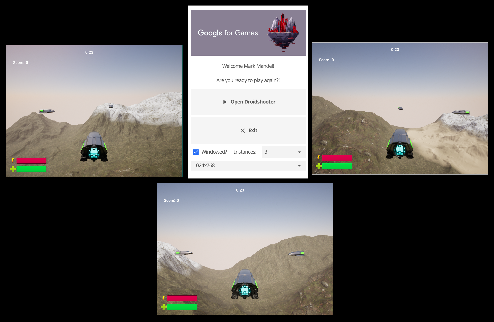
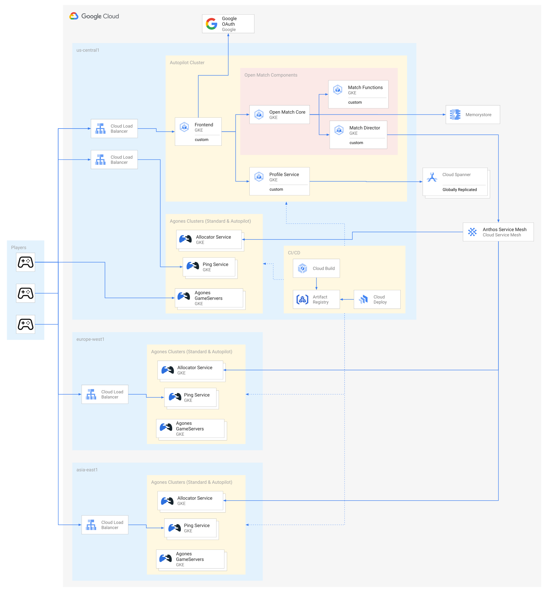

# Global, World Scale Multiplayer Game Demo



## Overview

This multiplayer demo is a cloud first implementation of a global scale, realtime multiplayer game utilising
dedicated game servers, utilising both Google Cloud's products and open source gaming solutions.

If you’re using this demo, please **★Star** this repository to show your interest!

**Note to Googlers**: Please fill out the form at [go/global-scale-game-form](http://go/global-scale-game-form). 
Details of the program can be found at [go/global-scale-game](http://go/global-scale-game).

Projects and products utilised include:

*   [Unreal Engine 5](https://www.unrealengine.com/) for the game client and server code.
*   A custom [Go](https://go.dev/) game launcher for client side authentication.
*   [Terraform](https://www.terraform.io/), for infrastructure as code.
*   [Cloud Build](https://cloud.google.com/build) and [Cloud Deploy](https://cloud.google.com/deploy) for Continuous Integration and Deployment.
*   [GKE Autopilot](https://cloud.google.com/kubernetes-engine/docs/concepts/autopilot-overview) for hosting the backend microservices.
*   [Anthos Service Mesh](https://cloud.google.com/anthos/service-mesh) for and cross cluster service discovery and communication.
*   Globally distributed [GKE](https://cloud.google.com/kubernetes-engine) Autopilot and/or Standard clusters running [Agones](https://agones.dev/) for hosting and scaling dedicated game servers.
*   [Open Match](https://open-match.dev/) for match making our global player base.
*   [Cloud Spanner](https://cloud.google.com/spanner) for storing the player in-game data.

## Architecture

The **Droid Shooter** game, is composed of a game client and dedicated server, and multiple backend services hosted
around the globe.

### Top Level Folders

| Folder                             | Description                                                                                                                                                                                                                                                                                   |
|------------------------------------|-----------------------------------------------------------------------------------------------------------------------------------------------------------------------------------------------------------------------------------------------------------------------------------------------|
| [infrastructure](./infrastructure) | This contains all the Terraform scripts and resources to create the infrastructure that the project relies on. It is worth noting that the Terraform scripts will generate configuration files that are used by Cloud Deploy and Kubernetes in both the `platform` and `services` directories |
| [platform](./platform)             | The `platform` directory contains the Cloud Build and Cloud Deploy scripts to set up the application platforms, such as Open Match and Agones, on the infrastructure that the `infrastructure` folder provisions.                                                                             |
| [services](./services)             | Contains the code for all the backend services that Droid Shooter requires, and Cloud Build and Cloud Deploy scripts to build and deploy these services to their appropriate hosting and storage infrastructure.                                                                              |
| [game](./game)                     | The code for the game launcher, client and server, as well as Cloud Build, Cloud Deploy and Agones configurations for building and hosting the dedicated game servers                                                                                                                         |

### System Components



| Component                                             | Technologies                 | Description                                                                                                                                                                                                                                               |
|-------------------------------------------------------|------------------------------|-----------------------------------------------------------------------------------------------------------------------------------------------------------------------------------------------------------------------------------------------------------|
| [Game Launcher](./game/GameLauncher)                  | Go, [Fyne] UI toolkit        | A launcher for the game, that handles both client side authentication and options for the game client execution.                                                                                                                                          |
| [Game Client and Server](./game)                      | Unreal Engine 5, Agones, GKE | The local game client for Droid Shooter, and the containerised dedicated game server it connects to when players play a game, hosted via an [Agones Fleet] on GKE Standard or Autopilot.                                                                  |
| [Frontend](./services/frontend)                       | Go, GKE Autopilot            | The single public entrypoint for all REST invocations from the launcher and client. It's main responsibility to ensure that the player their calls from the client are authenticated appropriately before passing on messages to other internal services. |
| [Ping Discovery](./services/ping-discovery)           | Go, GKE Autopilot            | This service will inspect a Google Cloud project for [Agones Latency Ping endpoints], and return one for each region that Agones is installed.                                                                                                            |
| [Profile](./services/profile)                         | Go, GKE Autopilot, Spanner   | The Profile Service provides a REST API to interact with Cloud Spanner to manage Player Profiles.                                                                                                                                                         |
| [Match Function](./services/open-match/matchfunction) | Go, Open Match, Memorystore  | A simple match making function that groups 3 players together based on latency and skill metrics                                                                                                                                                          |
| [Match Director](./services/open-match/director)      | Go, Open Match, Memorystore  | The Director allocates a GameServer from an GKE and Agones cluster hosted in the target region for a given set of match player's latencies, via the [Agones Allocator Service] on each cluster.                                                           |

[Fyne]: https://developer.fyne.io/index.html
[Agones Fleet]: https://agones.dev/site/docs/getting-started/create-fleet/
[Agones Latency Ping endpoints]: https://agones.dev/site/docs/guides/ping-service/
[Agones Allocator Service]: https://agones.dev/site/docs/advanced/allocator-service/

## Run in Your Google Cloud Project

> **Warning**
> This demo in its default state creates multiple Kubernetes clusters around the world,
> Spanner instances, and more. Running this demo for an extended amount of time may incur significant costs.

Follow these steps to have an instance of the global scale game running in your own Google Cloud Project.

### Prerequisites

To run the Game Demo install, you will need the following applications installed on your workstation:

* A Google Cloud Project
* [Terraform](https://developer.hashicorp.com/terraform/tutorials/aws-get-started/install-cli)
* [Google Cloud CLI](https://cloud.google.com/sdk/docs/install)

You can also click on the following icon to open this repository in a 'batteries-included' [Google Cloud Shell](https://cloud.google.com/shell) web development environment.

[](https://ssh.cloud.google.com/cloudshell/editor?cloudshell_git_repo=https%3A%2F%2Fgithub.com%2Fgoogleforgames%2Fglobal-multiplayer-demo.git&cloudshell_git_branch=main&cloudshell_open_in_editor=README.md&cloudshell_workspace=.)

### OAuth Authentication

We need to manually set up the OAuth authentication, as unfortunately this cannot be automated.

The details, such as name and email address of both of these steps don't matter, so feel free to use something
arbitrary for any part not specified.

Open the [Google OAuth consent screen](https://console.cloud.google.com/apis/credentials/consent) for your project,
and create an "External" App, and allow list any users you wish to be able to log in to your deployment of this game.

Open the [Google Credentials](https://console.cloud.google.com/apis/credentials) screen for your project, and click
"+ CREATE CREDENTIALS", and create an "OAuth Client ID" of type "Web Application".

Leave this page open, as we'll need the Client ID and Client secret of the ID you just created shortly.

### Infrastructure and Services

#### Google Cloud Auth

Once you have Google Cloud CLI installed, you will need to set your [GCP Project ID](https://support.google.com/googleapi/answer/7014113?hl=en#:~:text=The%20project%20ID%20is%20a,ID%20or%20create%20your%20own.):

```shell
export PROJECT_ID=<PROJECT_ID>
gcloud config set project ${PROJECT_ID}
```

and then authenticate to generate [Application Default Credentials (ADC)](https://cloud.google.com/docs/authentication/application-default-credentials) that can be leveraged by Terraform
```shell
gcloud auth application-default login
```

Clone this directory locally and, we'll also set an environment variable to it's root directory, for easy navigation:

```shell
git clone https://github.com/googleforgames/global-multiplayer-demo.git
cd global-multiplayer-demo
export GAME_DEMO_HOME=$(pwd)
```

#### Access to Unreal Engine Container Images

To build the Dedicated Game Server you will need access to the Unreal Engine GitHub organisation.

To do so, follow: [Accessing Unreal Engine source code on GitHub](https://www.unrealengine.com/en-US/ue-on-github).

Once done, to pull down the [Unreal Development Containers](https://unrealcontainers.com/), you will also need to
create [a personal access token (classic)](https://docs.github.com/en/authentication/keeping-your-account-and-data-secure/creating-a-personal-access-token#creating-a-personal-access-token-classic)
with at least `read:packages` scope.

Leave the page open with this token, as we'll need it shortly.

### Provision

#### Optional: GCS Backend

Normally Terraform stores the current state in the `terraform.tfstate` file locally. However, if you would like to have Terraform store the state file in a GCS Bucket, you can:

- [ ] Edit `backend.tf.sample`
- [ ] Change the `bucket =` line to an already created GCS bucket
- [ ] Rename `backend.tf.sample` to `backend.tf`.

NOTE: The GCS bucket does not have to exist in the same Google project as the Global Game but the Google 
user/service account running Terraform must have read & write access to that bucket.

#### Initialize Terraform & configure variables

```shell
cd $GAME_DEMO_HOME/infrastructure
terraform init
cp terraform.tfvars.sample terraform.tfvars
```

You will need to now edit `terraform.tfvars`

* Update <PROJECT_ID> with the ID of your Google Cloud Project,
* Updated <CLIENT_ID> and <CLIENT_SECRET> with the Client ID and Client secret created in the above step.
* Updated <GITHUB_PAT> with the GitHub personal access token you created the above steps.

You can edit other variables in this file, but we recommend leaving the default values for your first run before
experimenting.

#### Provision the infrastructure.

> **Warning**
> This demo in its default state creates multiple Kubernetes clusters around the world,
> Spanner instances, and more. Running this demo for an extended amount of time may incur significant costs.

```shell
terraform apply
```

#### OAuth Authentication

We now need to update our OAuth authentication configuration with the address of our authenticating frontend API.

Let's grab the IP for that API, by running:

```shell
gcloud compute addresses list --filter=name=frontend-service --format="value(address)"
```

This should give you back an IP, such as `35.202.107.204`.

1. Click "+ ADD URI" under "Authorised JavaScript origins" and add "http://[IP_ADDRESS].sslip.io".
2. Click "+ ADD URI" under "Authorised redirect URIs" and add "http://[IP_ADDRESS].sslip.io/callback"
3. Click "Save".

Since OAuth needs a domain to authenticate against, we'll use [sslip.io](https://sslip.io) for development purposes.

#### Deploy Platform Components
Cloud Build will deploy

- Anthos Service Mesh (ASM) to all clusters using the fleet feature API
- Agones using Cloud Deploy
- Open Match using Cloud Deploy

```shell
cd $GAME_DEMO_HOME/platform/
gcloud builds submit --config=cloudbuild.yaml
```

Navigate to the
[agones-deploy-pipeline](https://console.cloud.google.com/deploy/delivery-pipelines/us-central1/agones-deploy-pipeline)
delivery pipeline to review the rollout status. Cloud Build will create a Cloud Deploy release which automatically
deploys Agones the first game server cluster. Agones can be deployed to subsequent clusters by clicking on the
`promote` button within the Pipeline visualization or by running the following gcloud command:

```shell
## Replace RELEASE_NAME with the unique id generated from the Cloud Build.
gcloud deploy releases promote --release=RELEASE_NAME --delivery-pipeline=agones-deploy-pipeline --region=us-central1
```

Continue the promotion until Agones has been deployed to all clusters. You can monitor the status of the deployment
through the Cloud Logging URL returned by the `gcloud builds` command as well as the Kubernetes Engine/Workloads panel in the GCP Console.

Open Match rollout status can be viewed by navigating to the [global-game-open-match](https://console.cloud.google.com/deploy/delivery-pipelines/us-central1/global-game-open-match) delivery pipeline. Since open match is deployed onto a single services GKE cluster, deployments are automatically rolled out with no need for manual promotion.

### Deploy Cloud Spanner Schema

To deploy the database schema, submit the following Cloud Build command:

```shell
cd $GAME_DEMO_HOME/infrastructure/schema
gcloud builds submit --config=cloudbuild.yaml
```

This will deploy the schema migration using [Liquibase](https://www.liquibase.org/) and the [Cloud Spanner liquibase extension](https://github.com/cloudspannerecosystem/liquibase-spanner).

### Install Game Backend Services

To install all the backend services, submit the following Cloud Build command.

```shell
cd $GAME_DEMO_HOME/services
gcloud builds submit --config=cloudbuild.yaml
```

This will:

* Build all the images required for all services.
* Store those image in [Artifact Registry](https://cloud.google.com/artifact-registry)
* Deploy them via Cloud Build to an Autopilot cluster.

### Dedicated Game Server

To build the Unreal dedicated game server image, run the following command.

```shell
cd $GAME_DEMO_HOME/game
gcloud builds submit --config=cloudbuild.yaml
```

Cloud Build will deploy:

* Build the image for the dedicated game server.
* Store the image in [Artifact Registry](https://cloud.google.com/artifact-registry).
* Start the staged rollout of the Agones Fleet to each regional set of clusters.

> This will take ~20 minutes or so, so feel free to grab a cup of ☕

Navigate to the
[agones-deploy-pipeline](https://console.cloud.google.com/deploy/delivery-pipelines/us-central1/global-game-agones-gameservers)
delivery pipeline to review the rollout status. Cloud Build will create a Cloud Deploy release which automatically
deploys the game server Agones Fleet to the `asia-east1` region first.
The Fleet can be deployed to the next region in the queue via pressing the
`promote` button within the Pipeline visualization or by running the following gcloud command:

```shell
## Replace RELEASE_NAME with the unique build name
gcloud deploy releases promote --release=RELEASE_NAME --delivery-pipeline=global-game-agones-gameservers --region=us-central1
```

### Game Client

To build the Game Client for your host machine, you will need to
[install Unreal Engine from source](https://docs.unrealengine.com/5.2/en-US/building-unreal-engine-from-source/),
as the downloaded installation does not have the functionality to produce separate Client and Server builds.

This project currently uses **Unreal Engine 5.2.0**.

> Installing Unreal Engine from source can take several hours, and use all your CPU. You have been warned!

Open [`game/Droidshooter.uproject`](./game) in the Unreal Engine Editor.  

To package the project:

1. Select: Platforms > {your host platform} > DroidshooterClient
2. Platforms > {your host platform} > Cook Content
3. Platforms > {your host platform} > Package Project

During development, you can also run the game client directly within
the editor (Hit the ▶️ button).

To run the game client from inside the editor, you would need to launch the editor with -token=[JWT_TOKEN] -frontend_api=http://[IP_ADDRESS].sslip.io

Obtaining frontend api ip address can be achieved via:
```shell
gcloud compute addresses list --filter=name=frontend-service --format="value(address)"
```

JWT token can be obtained by accessing frontend api's ip address with '/login' path, such as "http://[IP_ADDRESS].sslip.io/login" and extracting it from the URL.


### Enable Cloud Linux VM for Game Client

You have the option to enable a GCP Linux VM for the Game Client. To have Terraform setup the VM, edit `terraform.tfvars` and set:

`enable_game_client_vm = true`

You can then connect to the VM using gcloud:

```shell
gcloud compute ssh game-client-vm
```
### Run the Game Launcher

To run the game launcher, you will need to have [Go](https://go.dev/dl/) installed to run it, as well as the
[prerequisites for the Fyne Go Cross Platform UI library](https://developer.fyne.io/started/).

```shell
cd $GAME_DEMO_HOME/game/GameLauncher

## grab your own copy of the app.ini
cp app.ini.sample app.ini

## Grab the IP Address again of our frontend service, so we can use it
gcloud compute addresses list --filter=name=frontend-service --format="value(address)"
```

Edit the app.ini, and replace the `frontend_api` value with http://[IP_ADDRESS].sslip.io

And update the `binary` field with the path to the executable of the client build for your operating system.

Then run the following to start the launcher!

```shell
go run main.go
```

You will need three players to play a game, so you can use the "Instances" drop down to create more than one
game client instance on your local machine. Depending on the capability of your graphics card, creating smaller 
resolution game client instances may be required.

Finally, click "Play an online match" on each game client, wait a few seconds for the matchmaking to occur, and when 
all clients have connected to the allocated game server - play a game! But remember, each game only lasts _30 
seconds_ so get started quickly!

## Troubleshooting

### This project was made with a different version of the Unreal Engine.

If you hit this issue, it may be that you are building on a different host platform than the original. or your
installation of Unreal may have a unique GUID. To solve, click: More Options > Convert in-place.

The project should open as normal now.

## Licence

Apache 2.0

This is not an officially supported Google product
